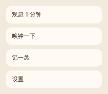
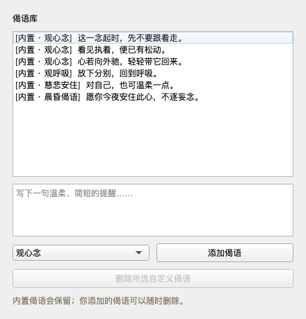

# Mindful Monk

English | [中文](README.md)

A quiet desktop companion. It does not push you to do more. It occasionally
invites you to notice the present thought and return to one breath.


## Features

- Frameless, always-on-top, draggable desktop companion
- Four animation sets: idle, prayer, breathing, and bell
- 144 reflections, including 110 excerpts from the Samyukta Agama and Diamond Sutra
- Scripture excerpts retain source, reference, and excerpt metadata, separately from built-in and personal content
- One-minute breathing session, gentle bell, scheduled or random reminders, and quiet hours
- Non-activating reflection overlays that do not interrupt drawing, writing, or typing
- **Record a thought**: select a current state and optionally add a short note
- **Thought traces**: review recent notes, see a small summary, or delete entries
- Custom reflections, character scaling, animation speed, and click-through mode
- Settings and personal notes remain local to the device




## Download

Download the package for your system from the [latest release](https://github.com/Bruce-CHN-LY/mindful-monk-desktop/releases/latest).

### macOS

Download `mindful-monk-macos-*.zip`, extract it, and open `一念小沙弥.app`.

The current macOS build is ad-hoc signed and not Apple-notarized. If Gatekeeper
blocks it, right-click the app, choose **Open**, and confirm once more.

### Windows

Download `mindful-monk-windows-x64.zip`, extract it, and run `Mindful-Monk.exe`.

> **The Windows build has not been tested in day-to-day use. It may contain
> compatibility issues or bugs. Reports through [GitHub Issues](https://github.com/Bruce-CHN-LY/mindful-monk-desktop/issues) are very welcome.**

## Controls

- Click the monk to open or close the quick menu
- Drag the monk to reposition it
- Double-click to ring the bell and receive a reflection
- Choose **听一句偈语** to receive a reflection immediately
- Choose **记一念** to record a state and optional note
- Choose **看念迹** to review, summarize, or delete notes
- Use the menu-bar icon to show, hide, enable click-through, or quit

Mindful notes are meant for awareness rather than judgment. There are no streaks
and no emotional scores.

## Run from source

Python 3.11, 3.12, or 3.13 is required.

```bash
git clone https://github.com/Bruce-CHN-LY/mindful-monk-desktop.git
cd mindful-monk-desktop
python3 -m venv .venv
.venv/bin/python -m pip install -r requirements-dev.txt
.venv/bin/python -m app.main
```

Windows PowerShell:

```powershell
git clone https://github.com/Bruce-CHN-LY/mindful-monk-desktop.git
cd mindful-monk-desktop
py -m venv .venv
.venv\Scripts\python -m pip install -r requirements-dev.txt
.venv\Scripts\python -m app.main
```

## Local data

- macOS: `~/Library/Application Support/Mindful Monk/`
- Windows: `%APPDATA%\Mindful Monk\`
- Linux: `$XDG_DATA_HOME/mindful-monk/` or `~/.local/share/mindful-monk/`

Personal settings, thought traces, and custom reflections are never committed to
the repository or uploaded by the app.

## Development and packaging

Run tests:

```bash
.venv/bin/python -m pytest -q
```

Build macOS:

```bash
./scripts/build_macos.sh
```

Build Windows:

```powershell
./scripts/build_windows.ps1
```

Pushing a `v*` tag runs the [GitHub Actions release workflow](.github/workflows/release.yml), which tests and builds on real Windows and macOS runners before creating a release.

## Content

- Built-in reflections: [app/assets/quotes.json](app/assets/quotes.json)
- Scripture excerpts: [app/assets/scripture_quotes.json](app/assets/scripture_quotes.json)
- Personal reflections: stored only in the local user-data directory

The excerpts are short prompts for reflection and study. They do not replace a
complete canonical text, scholarly collation, or religious guidance. Corrections
to wording and references are welcome through issues and pull requests.

## Acknowledgements

The original desktop-companion inspiration came from [yumiaura/myCat](https://github.com/yumiaura/myCat). This project is an independent implementation with different artwork and behavior. See [Third-party notices](THIRD_PARTY_NOTICES.md).

## License

Released under the [MIT License](LICENSE).
